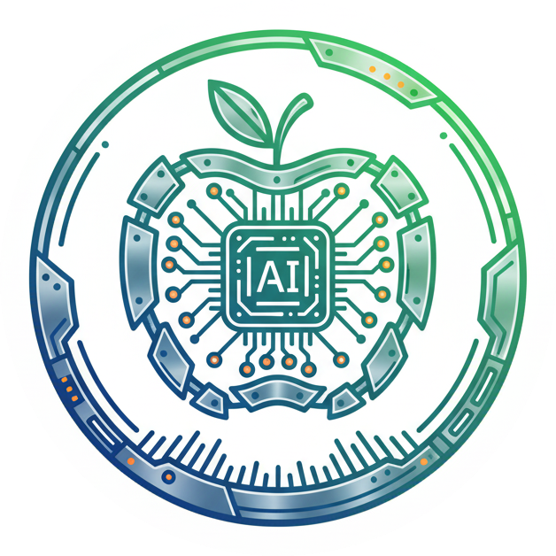
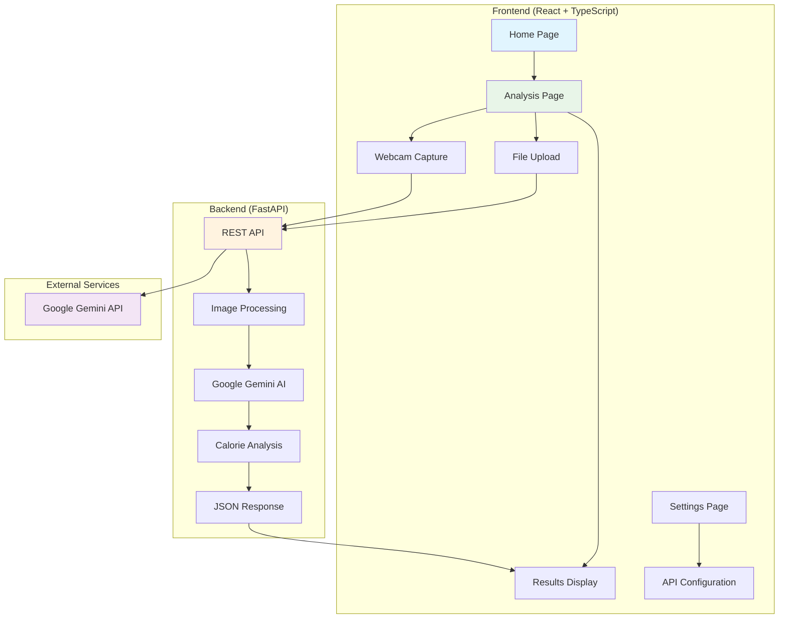

# Calories Advisor

<div align="center">
  
</div>

<div align="center">
  
  
  
  
  
  
  
  
</div>

<div align="center">
  <strong>GenAI-powered smart food analysis</strong><br>
  Upload food images and get instant calorie breakdowns with nutritional insights using Google's Gemini AI model.
</div>

## Project Overview

Calories Advisor is a comprehensive full-stack **GenAI application** that revolutionizes how people track their nutrition through AI-powered food analysis. Built with modern web technologies and powered by Google's Gemini AI, it provides an intuitive interface for users to capture food images and receive detailed nutritional insights in real-time.

### Key Benefits

- **Instant Analysis**: Get nutritional information in seconds, not minutes
- **No Manual Entry**: Simply take a photo instead of searching databases
- **Accurate Estimates**: AI-powered recognition provides more accurate calorie counts
- **Educational**: Learn about nutrition through detailed breakdowns
- **Accessible**: Works on any device with a camera
- **Privacy-Focused**: Your images are processed securely and not stored

### Target Users

- **Health Enthusiasts**: Track calories and macros effortlessly
- **Fitness Professionals**: Help clients with nutrition monitoring
- **Busy Professionals**: Quick nutrition tracking during busy schedules
- **Students**: Learn about nutrition through interactive analysis
- **Anyone**: Looking to improve their dietary awareness

## Live Demo

<div align="center">
  <strong>🚀 Successfully Deployed on Vercel</strong><br>
  <a href="https://calories-advisor-eight.vercel.app/" target="_blank">
    
  </a>
</div>

**Production URLs:**
- **Frontend**: [https://calories-advisor-eight.vercel.app/](https://calories-advisor-eight.vercel.app/)
- **Backend API**: [https://calories-advisor-eight.vercel.app/api](https://calories-advisor-eight.vercel.app/api)
- **API Documentation**: [https://calories-advisor-eight.vercel.app/api/docs](https://calories-advisor-eight.vercel.app/api/docs)

## Features

### Core Capabilities
- **Multiple Upload Methods**: File upload, drag & drop, and webcam capture
- **AI-Powered Analysis**: Detailed calorie breakdown using Google Gemini AI
- **Mobile Optimized**: Responsive design that works on all devices
- **Real-time Processing**: Instant analysis with loading indicators
- **Modern UI**: Beautiful interface built with Tailwind CSS

### Technical Features
- **REST API**: Clean FastAPI backend with automatic documentation
- **Type Safety**: Full TypeScript implementation
- **CORS Support**: Ready for production deployment
- **Error Handling**: Comprehensive validation and user feedback
- **Settings Management**: Configurable API keys and preferences

## Architecture



## Quick Start

### Try the Live Demo
The application is already deployed and ready to use at [https://calories-advisor-eight.vercel.app/](https://calories-advisor-eight.vercel.app/)

### Local Development Setup

**Prerequisites:**
- **Node.js** 16+ and npm
- **Python** 3.10+
- **Google Gemini API Key** ([Get one here](https://ai.google.dev/))

**Installation:**

1. **Clone the repository**
   ```bash
   git clone <repository-url>
   cd calories-advisor
   ```

2. **Backend Setup**
   ```bash
   cd backend
   pip install -r requirements.txt
   echo "GEMINI_API_KEY=your_api_key_here" > .env
   uvicorn app:app --reload --host 0.0.0.0 --port 8000
   ```

3. **Frontend Setup**
   ```bash
   cd frontend
   npm install
   npm start
   ```

4. **Access the Application**
   - **Frontend**: http://localhost:3000
   - **API Docs**: http://localhost:8000/docs

---

<div align="center">
  <strong>Built with React, FastAPI, and Google Gemini AI</strong>
</div>
